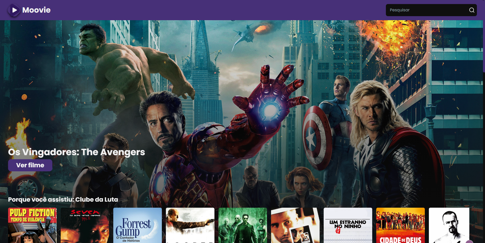
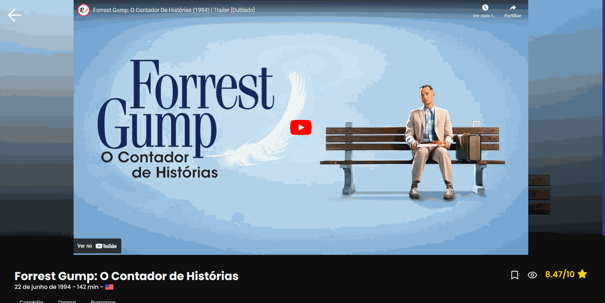

# Moovie

## A ideia
A ideia para a criação do Moovie surgiu da entrega para um trabalho na matéria de Web Development no 2º Semestre de Engenharia de Software na FIAP. Ele consiste em um site onde qualquer pessoa pode acessar informações variadas de filmes disponíveis no TMDB, essas informações vão desde trailers até onde eles podem ser assistidos.

## Funcionalidades
### Filmes em alta
No site você consegue ver os filmes que estão em alta no momento do acesso.

### Notas dos filmes
No Moovie você tem acesso as notas dos filmes calculadas pelo TMDB, você também consegue acessar os filmes melhores avaliados a qualquer momento.

### Lista de assistidos e favoritos
Você pode salvar filmes que você já assistiu ou que deseja assistir, facilitando o sistema de recomendação.

### Recomendações Personalizadas
Com base na sua lista de filmes assistidos, você pode acessar as recomendações do Moovie que ficam disponíveis nos banners da Home ou na lista 'Porque você assitiu:'

## Tecnologias Utilizadas
Para a criação do Moovie as principais tecnologias utilizadas:
- Vite + React
- Javascript
- TailwindCSS
- React Router DOM
- Shadcn/ui
- TMBD API

## Funcionalidades Técnicas
Algumas das funcionalidades técnicas no desenvolvimento do Moovie que acho legal compartilhar:

### Componentização
Como uma das funcionalidades básicas do React, criei e utilizei diversos componentes para a lógica do software

### Serviço para os filmes
Com meu aprendizado prévio no framework Anngular, foi possível criar um serviço em Javascript para armazenar toda a lógica de requisições para a API, tentando sempre separar essa lógica dos componentes.

### Cache de filmes
Para diminuir o número de requisições desenecessárias para a API e melhorar o desempenho da aplicação, criei um sistema para armazenar as principais listas de filmes que não mudam com tanta frequência no localStorage.

### Recomendações com base nos filmes assitidos
Como descrito nas Funcionalidades do Moovie, foi criado um sistema de recomendação com base nos filmes marcados como assistidos pelo usuário.

### Adendos
Acredito que esse projeto foi de grande importância para minhas habilidades técnicas com React, uma vez que, com ele pude fixar conceitos da biblioteca (como useState, useEffect e etc).

## [Clique aqui para testar a aplicação](https://qz-moovie.vercel.app/)

  
  
